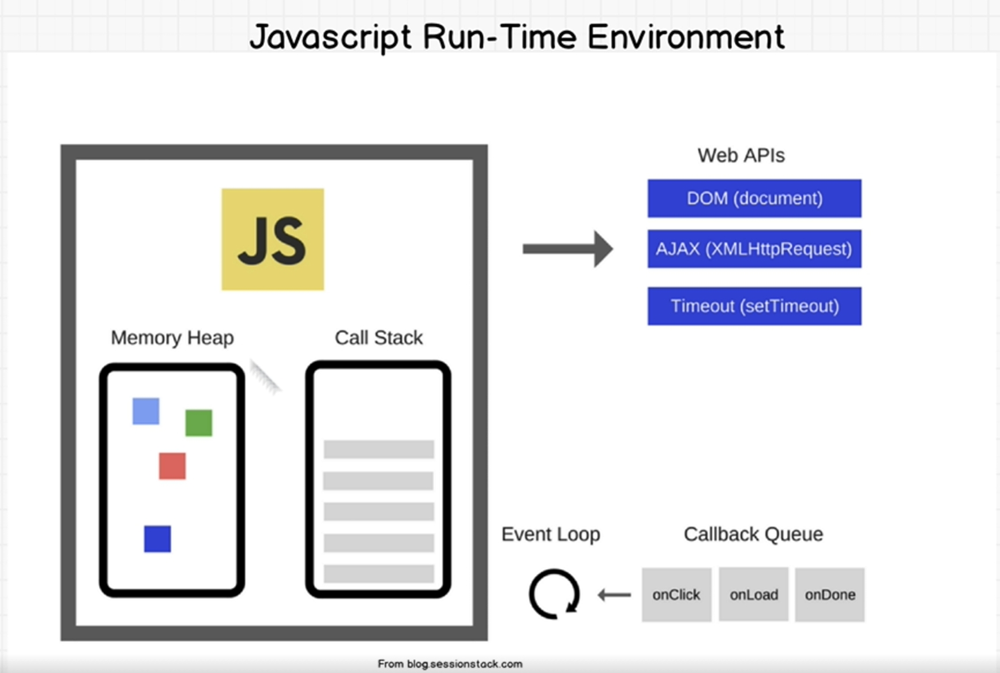

# data-structure-algorithms

## The 3 pillars of good code

1. **Readable**
2. **Time Complexity**
3. **Space Complexity**

## Big O


This is a good reference [site](https://www.bigocheatsheet.com/) for **Big O**

## Interview - How to solve problems

1. **Analytic Skills** - How can you think through problems and analyze things?
2. **Coding Skills** - Do you code well, by writing clean, simple, organized, readable code?
3. **Tehnical Skills** - Do you know the fundamentals of the job you're applying for?
4. **Communication Skills** - Does your personality match the companies’ culture?

### Data Structures

- [x] **Arrays**
- [ ] Staks $${\color{#f2eb5c}[wip]}$$
- [ ] Queues $${\color{#f2eb5c}[wip]}$$
- [x] Linked Lists
- [ ] Trees
- [ ] Tries
- [ ] Graphs
- [x] **Hash Tables**

### Algorithms

- Sorting
- Dynamic Programming
- BFS + DFS (Searching)
- Recursion
  
## Quick Notes

When you are askend in an interview about strings, you should be thinking like is an array. For example: when you are asked to reverse a string, convert the string into an array (with split() in javascript), do the operations, and then convet back to string.

Common Interview Question - How to manipulate a string

## [Javascript/ Typescript basic: Var vs Let vs Const](https://dev.to/sethusenthil/var-vs-let-vs-const-1cgc)

**Var** - have function scope - the variable's value can be accessed outside the if statement.

**Hoisting** - it tries to bring any sort of declaration (including named functions)on the topmost scope as possible

Since Vars use function scope, it brings it to the first line of the function. Keep in mind the Var is just being declared, not being assigned a value. That's why we are getting the string 'undefined' instead of 'error:var i is not defined'.

**Let**- use block scope

**Block scope** means that it can only be used within the whatever is being declared a.k.a the block

Let's (pun intended) take us old example and replace it with let:

As runkit suggests, i can only be accessed in the if statement after the line of the declaration. Hoisting has no power when we declare statements with let.

**Const** - uses block scope, so it has all the properties of let besides the ability to prevent redeclaration of the variable

As you can see above, there are a few exceptions. If you have declared a string or a number the value can't be changed either. But when you are declaring as an object, it gets a bit interesting.

Message's properties can be modified, or added but message cannot be redeclared into a integer with a value of 100.


## How Javascript Works

**Javascript** is a single threaded language that can be non-blocking

Single threaded it's means that is have only one call stack. This is synchronous program.

What is a program?

- allocate memory
- parse and execute - read and write

Tha Javascriot engine is read by browser engine (for Chrome is V8) and turn into machine executable instruction for the browser.

Javascript engine:

- Memory Heap - where memory allocation happends
- Call Stack - where your code is read and executed, is telling you where you are in the program

Memory Leak - happends when you have unused memory, this is why global variables are bad

```javascript
const one = () => {
    const two = () => {
        console.log('4');
    }
    two();
}

one() //Returns 4
```

```text
console.log('4') - first out
two() - second
one() - third
// CALL STACK
```

Stack overflow

```javascript
// Recoursion - a function that calls itself
function foo() {
    foo()
}

foo()
```

Asyncrous is the solution, but is not part of the javascript, is part of the browser.

```javascript
console.log('1');
setTimeout(() => {
    console.log('2');
}, 2000)
console.log('3');

// Returns: 1 3 2
```



For a time out the console.log has to be in a: call stack, web api, callback queue, event loop.

1. CALL STACK: has
```javascript
console.log('1'); - it is execute

setTimeout(() => {
    console.log('2');
}, 2000)
```

then it's passes to the web api
2. WEB API: setTimeout(), 2000 -> waits for 2 sec
3. CALLBACK QUEUE: callback() - for the console.log
4. EVENT LOOP: checks if the call stack is empty, and if is empty checks if there are any callbacks, if there are the callbacks are moved to the CALL STACK to be executed -> console.log(2)

## Javascript/ Typescript Notes

[**Spread Operator** [...value]](https://www.geeksforgeeks.org/how-to-use-spread-operator-in-typescript/)- is a powerful tool, that allows you to spread the elements of an array or objects into another array or objects. This operator makes it easy to copy arrays, combine arrays, or create shallow copies of iterable.

## Visual Studio Code Notes

**Ctrl + I** - to trigger a suggestion instead of **Ctrl + Space**

**Ctrl + .** - to trigger a quick fix
