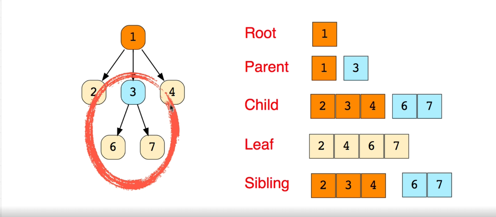
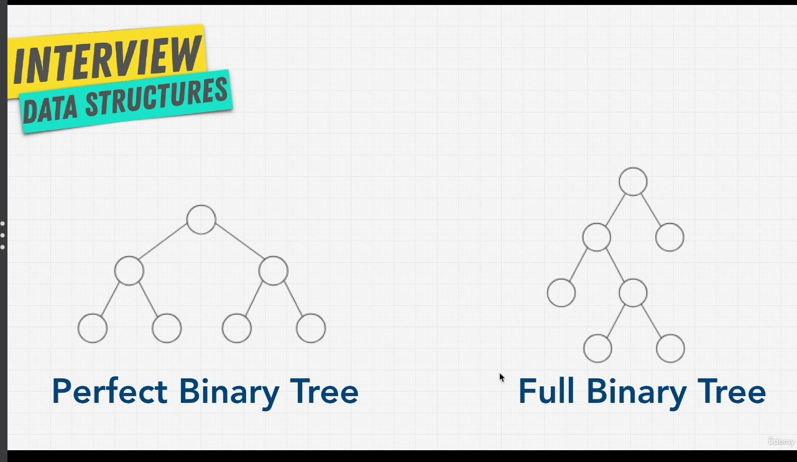
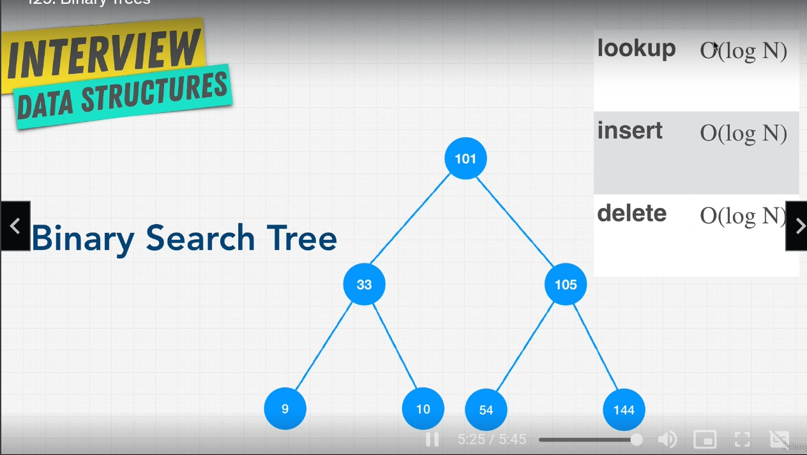
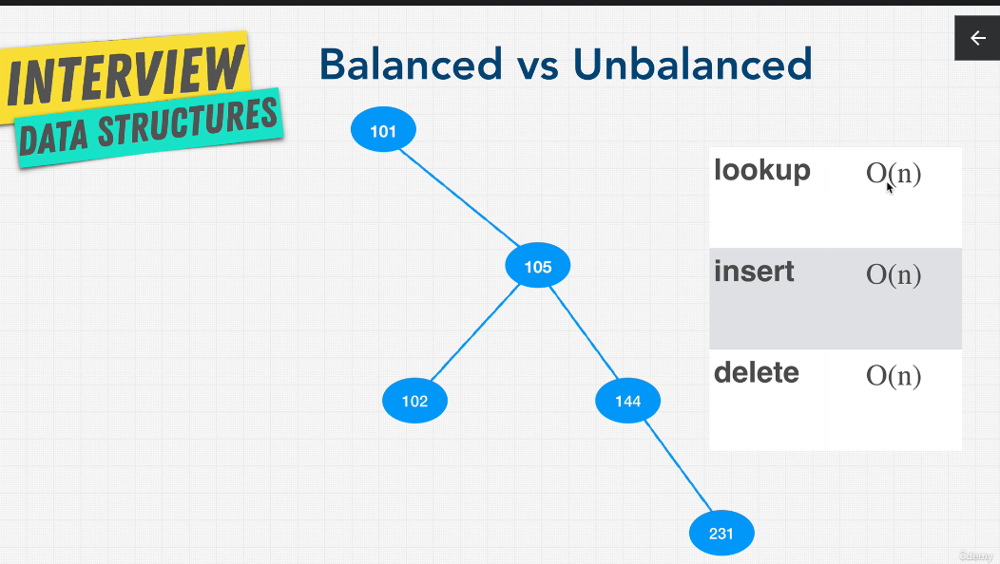

Trees are a data structure that have a hierarchical structure, can have multiple child nodes.

Trees have:

- parent - child relationship
- and leaf at the end of the tree
- can have subtrees (like the circle one in photo)
- nodes - like a linked list

Examples: 

- HTML structure is a tree

If you played chess online versus a computer, in the era when was not machine learning, the algorithm was a tree.

**Binary Tree** is a type of tree witha few rules aplied to it:

- each node can have either one, two or zero nodes
- each child can have one parent 
- each node represent a state

```javascript 
function BinaryTreeNode(value) {
    this.value = value;
    this.left = null;
    this.right = null;
}
```




The perfect binary tree:

- has no nodes that only have one child
- all the leaf are full
- a node ether have no children or 2 children
- on each level it is double the nodes

The full binary tree:

- a node have one or 2 children but no zero



Binary Search Tree:
- lookup - O(log n)
- insert - O(log n)
- delete - O(log n)

```text
Level 0: 2^0 = 1;
Level 1: 2^1 = 2;
Level 2: 2^2 = 4;
Level 3: 2^3 = 8;

# of nodes = 2^h - 1
log nodes = steps
```

```text
log 100 = 2
10^2 = 100
```




The unbalanced tree it can transform in a linked list and have O(n) complexity.

> In an interview it would not asked you to balance a tree because is time-consuming.


 $${\color{green}Pros}$$ for **Binary Search Trees**:

- Better than O(n)
- Ordered
- Flexible Size 
- they perform well if they are balanced

 $${\color{red}Cons}$$ for **Binary Search Trees**:

- No O(1) operations