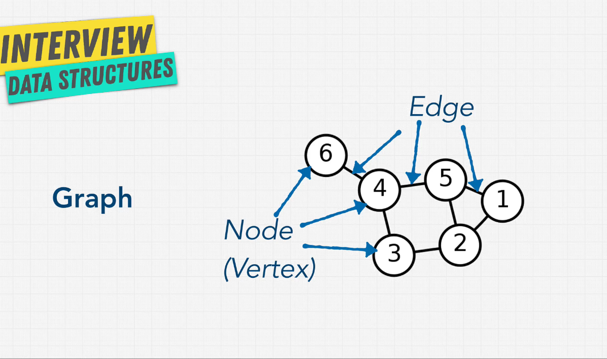
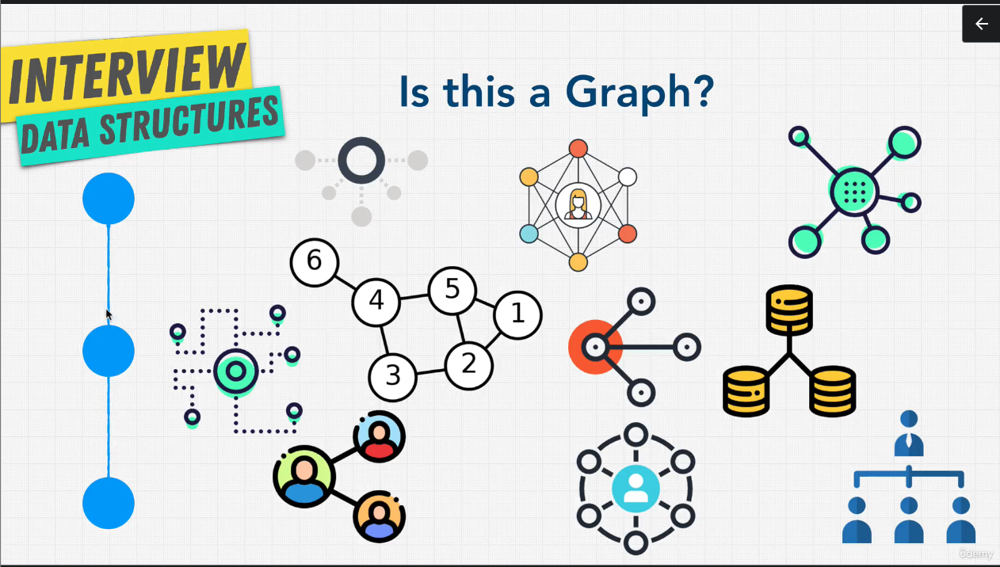
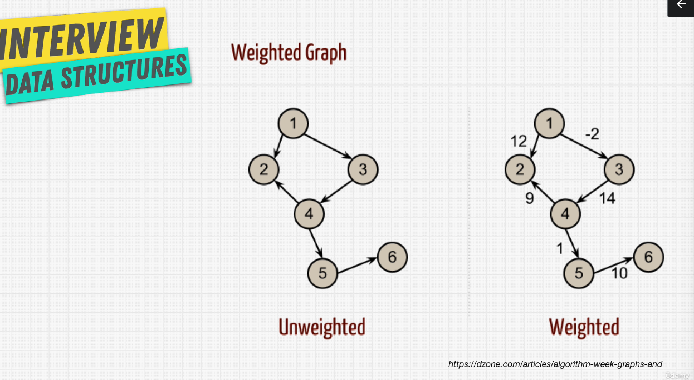
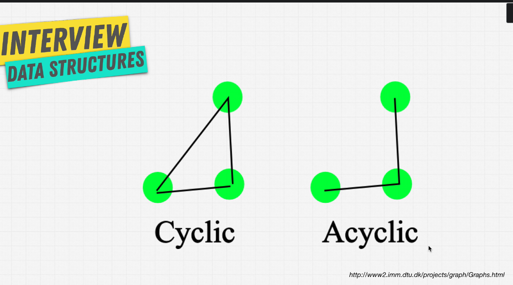

We can use graphs to reperesent:

- friendships
- family trees
- networks
- roads

There are two types of graphs **directed** and **undirected**.

The directed graphs are use to:

The undirected graphs are use to:

- describe trafic flow
- a system where the movement is not bidirectional

Facebook have an undirected graph because: when I am connected to a friend, that friend is connected to me.

Twitter is more directed becauseL when I have my profile, people can follow me and I can follow people, but when somebody follows me I don't automatically follow them.

The weighted graphs are used a lot in calculating shortest path.

Cyclic graphs are found in weighted graphs, in google maps, because is always a way to come back.