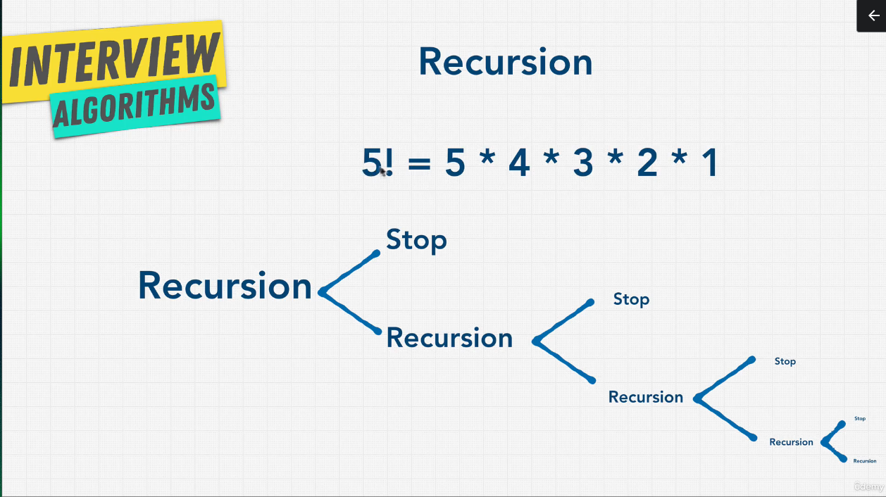
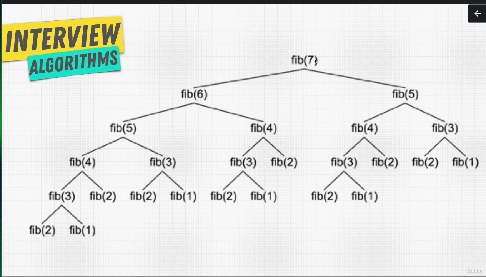

# Recusrion

Recursion is very good for task that have repeated things to do.

Recursion is used in :

- searching algorithm
- sorting algorithm
- traversing a tree
- doom traversing

Recusrion stack overflow example:

```typescript
function inseption() {
    inseption();
}

inseption();
```

Recusrion stack overflow repaired example:

```typescript
let counter: number = 0;
function inseption() {
    if(counter > 3) {
        return 'done!';
    }
    counter ++;
    return inseption(); // for returning the done string
}

inseption();
```

Rules to build recusrion functions:

1. Identify the base case
2. Identify the recursive case
3. Get closer and closer and retun when needed. Usually you have 2 returns





> Anything you do with a recursion CAN be done iteratively (loop)

$${\color{green}Pros}$$ for **Recursion**:

- DRY (do not repeat yourself)
- Readability

 $${\color{red}Cons}$$ for **Recursion**:

- Large Stack (this can be solved with [Tail call optimization](https://2ality.com/2015/06/tail-call-optimization.html))

## When you should use Recursion

- Every time you are using a tree or converting something into a tree, consider recursion.

  1. Divided into a number of subproblems that are smaller instances of the same problem.
  2. Each instance of the subproblem is identical in nature.
  3. The solutions of each subproblem can be combined to solve the problem at hand.
- Divide and Conquer using Recursion
