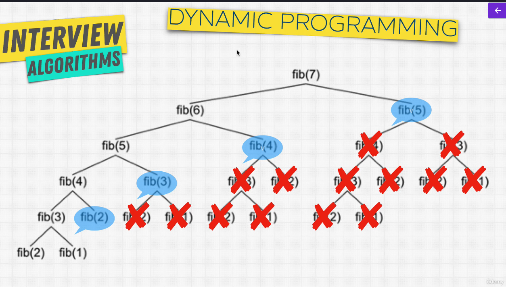
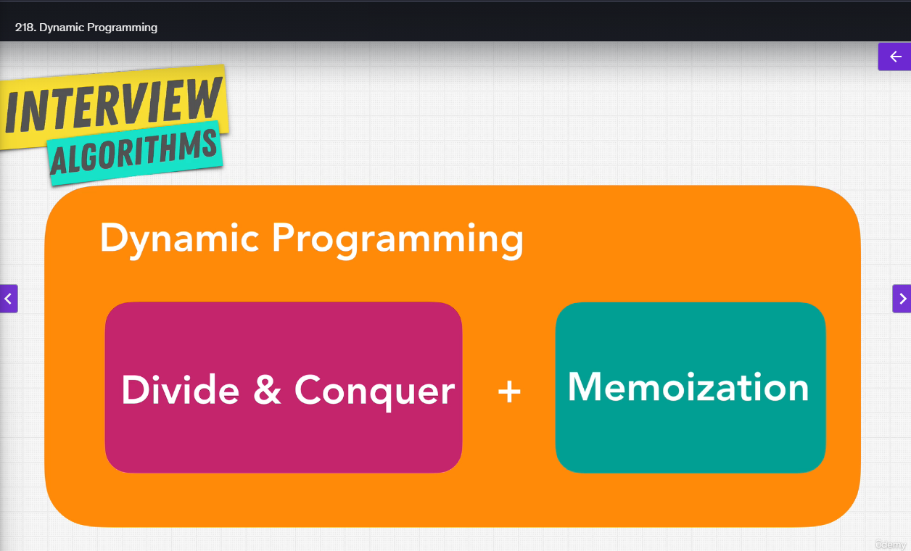

# dynamic programming

**Dynamic Programming** = it is an optimization technique

Do you have something you can cache? Dynamic Programming

Caching = is a way to store values that you can use them later on (ex. is like a backpack that you take to school, if you need something like a pencil, you have a small box on your back that holds items that you need)

Memoization is a specific form of caching that involves caching the return value based on it's parameters.

```javascript
// this is an example without memoization
function addTo80(n) {
    console.log('long time');
    return n + 80;
}

addTo80(5); // 85
addTo80(5); // 85
addTo80(5); // 85

// this is an improved vwrsion with cache added
let cache = {};
function memoizedAddTo80(n) {
    if(n in cache) {
        return cache[n];
    } else {
        console.log('long time');
        cache[n] = n + 80;
        return cache[n];
    }
}

memoizedAddTo80(5);
```

If the paramenter of the function does not change than is memoized.



When you think about dynamic programming



How to see if a problem can be solved with dynamic programming:

1. Can be divided into subproblem - is it a tree like structure witch each problem is broken down into smaller problems, witch usually indicates a recursive solution
2. Recursive Solution
3. Are there repetitive subproblems?
4. Memoize subproblems
5. Demand a raise from your boss
