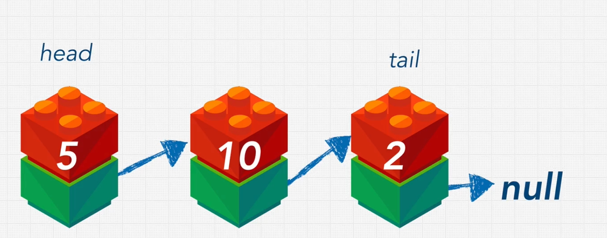

Liked List - a list that is linked - they have nodes 

A node is made of 2 elements - the value that we want to store and the pointer for the next element.

The first node is called **HEAD** and the last one is **TAIL**.

Linked List are NULL terminated - the end node points to null.



linked lists:  apples --> grapes --> pears

```
apples
8947 --> grapes 
        8742 --> pears 
                372 --> null
```

Linked lists have a loose structure, is easy to insert an element in the middle.

Iterating through a linked list is slower than interaring through an array because it do not have the indexes.

prepend - O(1)
append - O(1)
lookup - O(n)
insert - O(n)
delete - O(n)

A **pointer** is a reference to an object or something else in memory.

```javascript
let myLinkesList = {
   head: {
      value:10,
        next: {
          value: 5,
          next: {
            value: 16,
            next: null
          }
        }
    }
} 
```