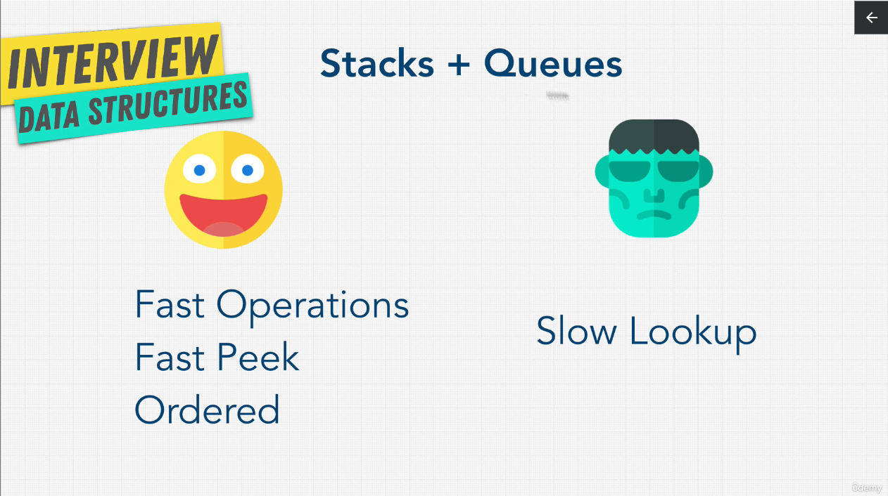

Stacks and Queues are built on arrays and linked lists, you can only pop and push.

Stacks - LIFO (last in first out)
 - **lookup** - O(n)
 - **pop** - O(1)
 - **push** - O(1)
 - **peek** - O(1)

 Most programming languages are wrote with stack  arhitecture in mind. 
 Stacks is good for browsing history or when you want to undo a message that you send.

 **Queues** - FIFO (first in first out)
  - **lookup** - O(n)
  - **enqueue** - O(1) - add an element to the queue
  - **dequeue** - O(1) - removes an element from the queue 
  - **peek** - O(1)

Queues are good for:
- for a wait list app - buy tickets for a concert
- restaurant app, for reserving a table 
- uber when you want to get a ride, the first person how requested a ride gets priority, then you are the second 
- printer, when multiple persons want to print somethig on that printer, the person that hints print first should have first print out

